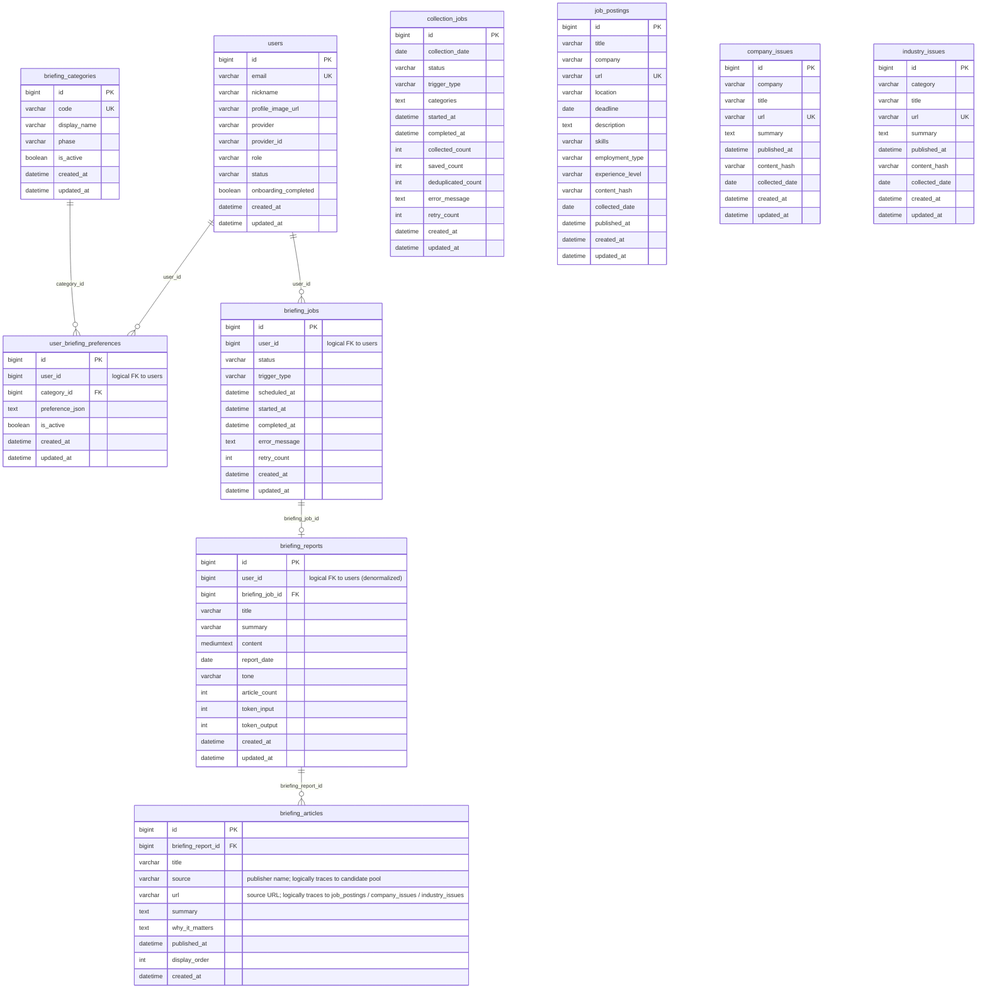

# Database Design

## ERD

> **Notes:**
> - `collection_jobs` tracks executions of the common daily collection workflow; it is an independent execution-log table with no FK into the candidate pool.
> - `job_postings`, `company_issues`, and `industry_issues` are candidate pool tables. **The Spring backend owns all writes** — the Agent returns raw job postings in the `POST /collections/daily` response, and Spring upserts them via `CandidatePoolService`. The Agent does not connect to the database directly. Spring reads the candidate pool during briefing generation and sends it to the Agent in the `candidatePool` field of the `POST /briefings/generate` request.
> - `briefing_reports` stores the final generated briefing per user per day.
> - `briefing_articles` stores article snapshots included in each report; `source` and `url` provide a logical trace back to the candidate pool tables, but no DB-level FK is enforced.
> - Some `user_id` columns (`briefing_jobs.user_id`, `briefing_reports.user_id`) are **logical FKs** stored as plain `BIGINT` — no DB-level `FOREIGN KEY` constraint is defined.
> - `delivery_logs` and `user_feedback` are **planned** tables; they are documented below but not yet implemented as Java entities.



---

## Overview

Briefy uses MySQL 8.0 (AWS RDS in production, Docker container in development).  
The backend accesses the database through Spring Boot JPA with Hibernate.

All table and column names use `snake_case`. All timestamps are stored as `DATETIME` (UTC). String enums are stored as `VARCHAR` and validated at the application layer.

---

## Tables

### `users`

Stores Google OAuth users. Briefy supports only Google sign-in for MVP — there is no password column.

| Column | Type | Constraints | Notes |
|---|---|---|---|
| `id` | BIGINT | PK, AUTO_INCREMENT | |
| `email` | VARCHAR(255) | UNIQUE NOT NULL | From OAuth provider |
| `nickname` | VARCHAR(100) | | Display name |
| `profile_image_url` | VARCHAR(500) | | OAuth profile photo URL |
| `provider` | VARCHAR(30) | NOT NULL | See `AuthProvider` |
| `provider_id` | VARCHAR(255) | NOT NULL | Provider's user ID |
| `role` | VARCHAR(30) | NOT NULL | See `UserRole` |
| `status` | VARCHAR(30) | NOT NULL | See `UserStatus` |
| `onboarding_completed` | BOOLEAN | NOT NULL DEFAULT FALSE | True after first preference setup |
| `created_at` | DATETIME | | |
| `updated_at` | DATETIME | | |

**Enums**

| Enum | Values |
|---|---|
| `AuthProvider` | `GOOGLE` |
| `UserRole` | `USER`, `ADMIN` |
| `UserStatus` | `ACTIVE`, `DELETED` |

**Indexes**

```sql
UNIQUE INDEX uq_users_email            (email)
UNIQUE INDEX uq_users_provider         (provider, provider_id)
INDEX        idx_users_status           (status)
```

**Relationships**

- 1:N → `user_briefing_preferences`
- 1:N → `briefing_jobs`
- 1:N → `briefing_reports`
- 1:N → `delivery_logs`
- 1:N → `user_feedbacks`
- 1:1 → `notification_settings`

---

### `briefing_categories`

Predefined briefing type categories. Seeded at application startup; not user-generated.

Each row represents a distinct type of briefing the service can produce. The 1st MVP activates only `JOB_POSTING`; later phases activate `COMPANY_NEWS` and `INDUSTRY_TREND`.

| Column | Type | Constraints | Notes |
|---|---|---|---|
| `id` | BIGINT | PK, AUTO_INCREMENT | |
| `code` | VARCHAR(50) | UNIQUE NOT NULL | Enum key: `JOB_POSTING`, `COMPANY_NEWS`, `INDUSTRY_TREND` |
| `name` | VARCHAR(100) | NOT NULL | Human-readable label |
| `description` | VARCHAR(500) | | Shown on preference setup UI |
| `phase` | VARCHAR(20) | NOT NULL | MVP phase: `FIRST`, `ONE_FIVE`, `SECOND` |
| `is_active` | BOOLEAN | NOT NULL DEFAULT TRUE | Inactive rows are hidden from UI |
| `display_order` | INT | | Controls ordering on UI |
| `created_at` | DATETIME | | |
| `updated_at` | DATETIME | | |

**Seed data**

| code | name | phase | is_active |
|---|---|---|---|
| `JOB_POSTING` | 채용 공고 브리핑 | `FIRST` | TRUE |
| `COMPANY_NEWS` | 관심 기업 브리핑 | `ONE_FIVE` | FALSE |
| `INDUSTRY_TREND` | 산업/시장 브리핑 | `SECOND` | FALSE |

Only `JOB_POSTING` is active and visible during the 1st MVP. `COMPANY_NEWS` and `INDUSTRY_TREND` rows are seeded but inactive; they become active in later phases.

**Indexes**

```sql
UNIQUE INDEX uq_briefing_categories_code    (code)
INDEX        idx_briefing_categories_active (is_active)
```

**Relationships**

- 1:N → `user_briefing_preferences`

---

### `user_briefing_preferences`

Stores a user's preferences for a specific briefing category. One row per `(user, category)` pair.

Unlike a flat keyword-per-topic model, this table stores all preference dimensions for a category in a single JSON column. The JSON approach keeps the schema flexible across MVP phases — different categories have different preference shapes.

| Column | Type | Constraints | Notes |
|---|---|---|---|
| `id` | BIGINT | PK, AUTO_INCREMENT | |
| `user_id` | BIGINT | FK `users.id` NOT NULL | |
| `category_id` | BIGINT | FK `briefing_categories.id` NOT NULL | |
| `is_active` | BOOLEAN | NOT NULL DEFAULT TRUE | Soft-delete: set to FALSE instead of hard-delete |
| `preference_json` | JSON | NOT NULL | Category-specific preference data (see schema below) |
| `created_at` | DATETIME | | |
| `updated_at` | DATETIME | | |

**`preference_json` schema — `JOB_POSTING` category (1st MVP)**

```json
{
  "roles": ["백엔드 개발자", "풀스택 개발자"],
  "companies": ["네이버", "카카오", "라인"],
  "skills": ["Spring Boot", "Java", "Kotlin"],
  "locations": ["서울", "판교"],
  "experienceLevels": ["신입", "3년 이상"],
  "employmentTypes": ["정규직"]
}
```

| Field | Type | Notes |
|---|---|---|
| `roles` | Array\<String\> | Target job roles |
| `companies` | Array\<String\> | Target companies; used for both posting search and company news |
| `skills` | Array\<String\> | Required or preferred skills / competencies |
| `locations` | Array\<String\> | Preferred work locations |
| `experienceLevels` | Array\<String\> | e.g. `신입`, `경력 3년 이상` |
| `employmentTypes` | Array\<String\> | e.g. `정규직`, `계약직`, `인턴` |

**`preference_json` schema — `COMPANY_NEWS` category (1.5 MVP, for reference)**

```json
{
  "watchedCompanies": ["네이버", "카카오", "토스"],
  "alertSignals": ["HIRING_CHANGE", "EARNINGS", "BUSINESS_ISSUE"]
}
```

**`preference_json` schema — `INDUSTRY_TREND` category (2nd MVP, for reference)**

```json
{
  "industries": ["IT/AI", "반도체", "플랫폼"],
  "keywords": ["LLM", "파운드리", "쿠팡"]
}
```

**Evolution note:** The JSON approach is intentional for MVP flexibility. If search performance, analytics, or recommendation features require structured querying of individual preference fields, the JSON can be normalized into dedicated tables (`user_job_preference_roles`, etc.) in a later migration without changing the external API contract.

**Indexes**

```sql
UNIQUE INDEX uq_user_briefing_pref  (user_id, category_id)
INDEX        idx_ubp_user           (user_id)
INDEX        idx_ubp_category       (category_id)
INDEX        idx_ubp_active         (is_active)
```

**Notes**

- At most one active row per `(user_id, category_id)` — enforced by the unique index.
- Deletion is soft: set `is_active = FALSE`. Do not hard-delete so that briefing history remains coherent.

**Relationships**

- N:1 → `users`
- N:1 → `briefing_categories`

---

### `job_postings`

Candidate pool for job briefings. Written by the Agent `DailyCollectWorkflow`; read by `UserBriefingWorkflow` to generate user-specific briefings without re-fetching from external sources.

| Column | Type | Constraints | Notes |
|---|---|---|---|
| `id` | BIGINT | PK, AUTO_INCREMENT | |
| `title` | VARCHAR(500) | NOT NULL | Job posting title |
| `company` | VARCHAR(255) | NOT NULL | Hiring company name |
| `source` | VARCHAR(255) | | Source platform (e.g. Wanted, 사람인, LinkedIn) |
| `url` | VARCHAR(1000) | UNIQUE NOT NULL | Original URL; used for deduplication |
| `location` | VARCHAR(255) | | Work location |
| `roles` | TEXT | | JSON array of matched role tags |
| `skills` | TEXT | | JSON array of required skill tags |
| `experience_level` | VARCHAR(100) | | e.g. `신입`, `3년 이상` |
| `employment_type` | VARCHAR(100) | | e.g. `정규직`, `계약직` |
| `deadline` | DATE | | Application deadline (`NULL` if not specified) |
| `description_summary` | TEXT | | Agent-generated summary of the posting |
| `content_hash` | VARCHAR(64) | | SHA-256 of key fields; used to detect changed postings |
| `collected_date` | DATE | NOT NULL | Date the row was inserted by the collector |
| `published_at` | DATETIME | | Original publication time from the source |
| `created_at` | DATETIME | | |
| `updated_at` | DATETIME | | |

**Indexes**

```sql
UNIQUE INDEX uq_job_postings_url         (url)
INDEX        idx_job_postings_company     (company)
INDEX        idx_job_postings_deadline    (deadline)
INDEX        idx_job_postings_collected   (collected_date)
INDEX        idx_job_postings_hash        (content_hash)
```

**Notes**

- `url` uniqueness prevents re-inserting the same posting on repeated collection runs.
- `content_hash` allows detecting changed postings (e.g. deadline extension) for future update logic.
- **Spring owns all writes** via `CandidatePoolService.upsertJobPostings` after the Agent returns raw postings. Spring also owns reads during briefing generation.
- Rows older than a configurable retention window (e.g. 30 days past deadline) can be purged in future.

---

### `company_issues`

Candidate pool for company news briefings. Written by Agent `DailyCollectWorkflow`. Used by `COMPANY_NEWS` briefing category (1.5 MVP).

| Column | Type | Constraints | Notes |
|---|---|---|---|
| `id` | BIGINT | PK, AUTO_INCREMENT | |
| `company` | VARCHAR(255) | NOT NULL | Company name |
| `title` | VARCHAR(500) | NOT NULL | News or event headline |
| `source` | VARCHAR(255) | | Publisher / domain name |
| `url` | VARCHAR(1000) | UNIQUE NOT NULL | Original URL |
| `summary` | TEXT | | Agent-generated summary |
| `issue_type` | VARCHAR(50) | | e.g. `HIRING_CHANGE`, `BUSINESS_ISSUE`, `EARNINGS` |
| `published_at` | DATETIME | | Original publication time |
| `collected_date` | DATE | NOT NULL | Date collected |
| `created_at` | DATETIME | | |

> **1.5 MVP scope.** This table is scaffolded now for schema consistency. Do not populate or read from it during the 1st MVP.

**Indexes**

```sql
UNIQUE INDEX uq_company_issues_url       (url)
INDEX        idx_company_issues_company  (company)
INDEX        idx_company_issues_date     (collected_date)
```

---

### `industry_issues`

Candidate pool for industry / market briefings. Written by Agent `DailyCollectWorkflow`. Used by `INDUSTRY_TREND` briefing category (2nd MVP).

| Column | Type | Constraints | Notes |
|---|---|---|---|
| `id` | BIGINT | PK, AUTO_INCREMENT | |
| `industry` | VARCHAR(100) | NOT NULL | e.g. `IT/AI`, `반도체`, `플랫폼`, `금융`, `콘텐츠` |
| `title` | VARCHAR(500) | NOT NULL | News or trend headline |
| `source` | VARCHAR(255) | | Publisher / domain name |
| `url` | VARCHAR(1000) | UNIQUE NOT NULL | Original URL |
| `summary` | TEXT | | Agent-generated summary |
| `published_at` | DATETIME | | Original publication time |
| `collected_date` | DATE | NOT NULL | Date collected |
| `created_at` | DATETIME | | |

> **2nd MVP scope.** Content must be information-only. Never generate or suggest buy/sell recommendations anywhere in prompts, copy, or tool responses.

**Indexes**

```sql
UNIQUE INDEX uq_industry_issues_url       (url)
INDEX        idx_industry_issues_industry (industry)
INDEX        idx_industry_issues_date     (collected_date)
```

---

### `briefing_jobs`

Tracks the lifecycle of a briefing generation request. One job produces at most one report.

| Column | Type | Constraints | Notes |
|---|---|---|---|
| `id` | BIGINT | PK, AUTO_INCREMENT | |
| `user_id` | BIGINT | FK `users.id` NOT NULL | |
| `status` | VARCHAR(30) | NOT NULL | See `BriefingJobStatus` |
| `trigger_type` | VARCHAR(30) | NOT NULL | See `BriefingTriggerType` |
| `scheduled_at` | DATETIME | | When the job was intended to run |
| `started_at` | DATETIME | | When processing began |
| `completed_at` | DATETIME | | When job finished (success or failure) |
| `error_message` | TEXT | | Populated on `FAILED` status |
| `retry_count` | INT | NOT NULL DEFAULT 0 | Number of retry attempts |
| `created_at` | DATETIME | | |
| `updated_at` | DATETIME | | |

**Enums**

| Enum | Values |
|---|---|
| `BriefingJobStatus` | `PENDING`, `PROCESSING`, `COMPLETED`, `FAILED` |
| `BriefingTriggerType` | `SCHEDULED`, `MANUAL` |

**State machine**

```
PENDING → PROCESSING → COMPLETED
                    ↘ FAILED (→ retry → PENDING)
```

**Indexes**

```sql
INDEX idx_briefing_jobs_user            (user_id)
INDEX idx_briefing_jobs_status          (status)
INDEX idx_briefing_jobs_scheduled_at    (scheduled_at)
INDEX idx_briefing_jobs_user_scheduled  (user_id, scheduled_at)
```

**Relationships**

- N:1 → `users`
- 1:1 → `briefing_reports`

---

### `briefing_reports`

Stores the generated briefing output. Linked 1:1 to a completed job. The `content` field holds the full briefing as Markdown.

| Column | Type | Constraints | Notes |
|---|---|---|---|
| `id` | BIGINT | PK, AUTO_INCREMENT | |
| `user_id` | BIGINT | FK `users.id` NOT NULL | Denormalized for query convenience |
| `briefing_job_id` | BIGINT | FK `briefing_jobs.id` UNIQUE NOT NULL | 1:1 relationship enforced here |
| `title` | VARCHAR(255) | NOT NULL | Generated title |
| `summary` | VARCHAR(1000) | | Short teaser (used in email subject/preview) |
| `content` | MEDIUMTEXT | NOT NULL | **Full briefing in Markdown format** |
| `report_date` | DATE | NOT NULL | The date the briefing covers |
| `tone` | VARCHAR(30) | | Tone used for LLM generation (e.g. `PROFESSIONAL`) |
| `article_count` | INT | | Number of source articles processed |
| `token_input` | INT | | LLM input tokens used |
| `token_output` | INT | | LLM output tokens used |
| `created_at` | DATETIME | | |
| `updated_at` | DATETIME | | |

**Notes**

- `content` is Markdown for MVP. Future versions may switch to a structured JSON format for richer rendering.
- `token_input` / `token_output` are recorded for cost tracking and are visible to `ADMIN` users.
- `user_id` is denormalized (also accessible via `briefing_job_id → briefing_jobs.user_id`) for efficient single-table queries on the user's briefing history.

**Indexes**

```sql
UNIQUE INDEX uq_briefing_reports_job       (briefing_job_id)
INDEX        idx_briefing_reports_user      (user_id)
INDEX        idx_briefing_reports_date      (report_date)
INDEX        idx_briefing_reports_user_date (user_id, report_date)
```

**Relationships**

- N:1 → `users`
- 1:1 → `briefing_jobs`
- 1:N → `briefing_articles`
- 1:N → `delivery_logs`
- 1:N → `user_feedbacks`

---

### `briefing_articles`

Individual source articles included in a briefing report. Optional for a minimal MVP but recommended because it enables per-article feedback, source attribution, and future deduplication caching.

| Column | Type | Constraints | Notes |
|---|---|---|---|
| `id` | BIGINT | PK, AUTO_INCREMENT | |
| `briefing_report_id` | BIGINT | FK `briefing_reports.id` NOT NULL | |
| `title` | VARCHAR(500) | NOT NULL | Article headline |
| `source` | VARCHAR(255) | | Publisher / domain name |
| `url` | VARCHAR(1000) | | Original article URL |
| `summary` | TEXT | | Agent-generated one-paragraph summary |
| `why_it_matters` | TEXT | | Agent-generated relevance explanation |
| `published_at` | DATETIME | | Original publication time |
| `display_order` | INT | | Order within the report |
| `created_at` | DATETIME | | |

**Indexes**

```sql
INDEX idx_briefing_articles_report (briefing_report_id)
INDEX idx_briefing_articles_url    (url)
```

**Notes**

- `url` index enables deduplication across briefings in a future caching layer.
- No `updated_at`: article rows are write-once after the briefing job completes.

**Relationships**

- N:1 → `briefing_reports`

---

### `delivery_logs`

Records every email delivery attempt and its outcome. One report may have multiple log entries (e.g. initial attempt + retry).

| Column | Type | Constraints | Notes |
|---|---|---|---|
| `id` | BIGINT | PK, AUTO_INCREMENT | |
| `briefing_report_id` | BIGINT | FK `briefing_reports.id` NOT NULL | |
| `user_id` | BIGINT | FK `users.id` NOT NULL | Denormalized for query convenience |
| `channel` | VARCHAR(30) | NOT NULL | See `DeliveryChannel` |
| `status` | VARCHAR(30) | NOT NULL | See `DeliveryStatus` |
| `recipient` | VARCHAR(255) | NOT NULL | Email address (or channel-specific handle) |
| `sent_at` | DATETIME | | Populated on successful send |
| `error_message` | TEXT | | Populated on `FAILED` status |
| `created_at` | DATETIME | | |
| `updated_at` | DATETIME | | |

**Enums**

| Enum | Values | MVP? |
|---|---|---|
| `DeliveryChannel` | `EMAIL` | MVP |
| | `KAKAO`, `SLACK` | Future |
| `DeliveryStatus` | `PENDING`, `SENT`, `FAILED` | |

**Indexes**

```sql
INDEX idx_delivery_logs_report (briefing_report_id)
INDEX idx_delivery_logs_user   (user_id)
INDEX idx_delivery_logs_status (status)
```

**Notes**

- Only `EMAIL` is implemented for MVP. `KAKAO` and `SLACK` enum values are reserved; do not implement them yet.
- `user_id` is denormalized from the report for fast per-user delivery history queries.

**Relationships**

- N:1 → `briefing_reports`
- N:1 → `users`

---

### `user_feedbacks`

Records a user's reaction to a briefing report. MVP stores the data only; future versions will use it to personalize preference weighting.

| Column | Type | Constraints | Notes |
|---|---|---|---|
| `id` | BIGINT | PK, AUTO_INCREMENT | |
| `user_id` | BIGINT | FK `users.id` NOT NULL | |
| `briefing_report_id` | BIGINT | FK `briefing_reports.id` NOT NULL | |
| `feedback_type` | VARCHAR(50) | NOT NULL | See `FeedbackType` |
| `comment` | VARCHAR(1000) | | Optional free-text comment |
| `created_at` | DATETIME | | |

**Enums**

| Enum | Values |
|---|---|
| `FeedbackType` | `USEFUL`, `NOT_USEFUL`, `WANT_MORE`, `LESS_LIKE_THIS` |

**Indexes**

```sql
INDEX idx_user_feedbacks_user   (user_id)
INDEX idx_user_feedbacks_report (briefing_report_id)
```

**Notes**

- No `updated_at`: feedback rows are write-once.
- A user can submit multiple feedback entries per report — uniqueness is not enforced at the DB level for MVP.
- Future: aggregate `USEFUL`/`NOT_USEFUL` ratios per preference category to improve ranking weights in `UserBriefingWorkflow` automatically.

**Relationships**

- N:1 → `users`
- N:1 → `briefing_reports`

---

### `notification_settings`

One row per user. Stores the user's preferred delivery time and channel toggles. Optional for a minimal MVP but useful for the settings dashboard and future scheduled delivery.

| Column | Type | Constraints | Notes |
|---|---|---|---|
| `id` | BIGINT | PK, AUTO_INCREMENT | |
| `user_id` | BIGINT | FK `users.id` UNIQUE NOT NULL | 1:1 with users |
| `email_enabled` | BOOLEAN | NOT NULL DEFAULT TRUE | |
| `delivery_time` | TIME | | Preferred local time for daily briefing |
| `timezone` | VARCHAR(50) | DEFAULT `'Asia/Seoul'` | IANA timezone identifier |
| `created_at` | DATETIME | | |
| `updated_at` | DATETIME | | |

**Indexes**

```sql
UNIQUE INDEX uq_notification_settings_user (user_id)
```

**Notes**

- Created automatically (with defaults) when a user completes onboarding.
- `delivery_time` + `timezone` together determine when the scheduler enqueues a `briefing_job` for this user.
- Future channels (Kakao, Slack) will add `kakao_enabled`, `slack_enabled` columns rather than a new table.

**Relationships**

- 1:1 → `users`

---

## Entity Relationship Summary

```
users ──────────────────────────────────────────────────────────────────────────┐
  │ 1:N user_briefing_preferences (preference per briefing category)             │
  │       N:1 briefing_categories                                                │
  │                                                                              │
  │ 1:N briefing_jobs (generation lifecycle)                                     │
  │       1:1 briefing_reports (Markdown content)                               │
  │             1:N briefing_articles (source articles)                          │
  │             1:N delivery_logs (email send attempts)  ←── also N:1 users     │
  │             1:N user_feedbacks (reactions)           ←── also N:1 users     │
  │                                                                              │
  │ 1:1 notification_settings (delivery preferences)                             │
  └────────────────────────────────────────────────────────────────────────────┘

Candidate pool tables (written by Spring after Agent returns raw data; read by Spring before calling Agent for briefing):

  job_postings       ← 1st MVP  (JOB_POSTING category)
  company_issues     ← 1.5 MVP  (COMPANY_NEWS category)  [placeholder — not populated in 1st MVP]
  industry_issues    ← 2nd MVP  (INDUSTRY_TREND category) [placeholder — not populated in 1st MVP]
```

---

## Spring Profile / DDL Strategy

| Profile | `ddl-auto` | Use |
|---|---|---|
| `local` | `update` | Schema is updated in place on each boot. Safe for local development; data persists across restarts. |
| `dev` | `update` | Schema is migrated in place. Use for shared dev environment. |
| `prod` | `validate` | Hibernate validates schema against entities but makes no changes. Use Flyway or Liquibase for migrations. |

> For production schema migrations, use a migration tool (Flyway recommended). Do not rely on `ddl-auto: update` in production.

---

## Notes on Content Format

- **`briefing_reports.content`** is stored as Markdown for MVP. The frontend renders it with a Markdown parser (e.g. `react-markdown`). Future versions may switch to a structured JSON format (sections, bullets, article cards) for richer client-side rendering.
- **`briefing_articles.summary`** and **`.why_it_matters`** are plain text generated by the agent. No special formatting is assumed.
- **`user_briefing_preferences.preference_json`** is a JSON object. The backend reads it as a typed DTO per category; do not store it as a raw string in JPA entities — use `@Column(columnDefinition = "JSON")` with a converter or `@Type`.
